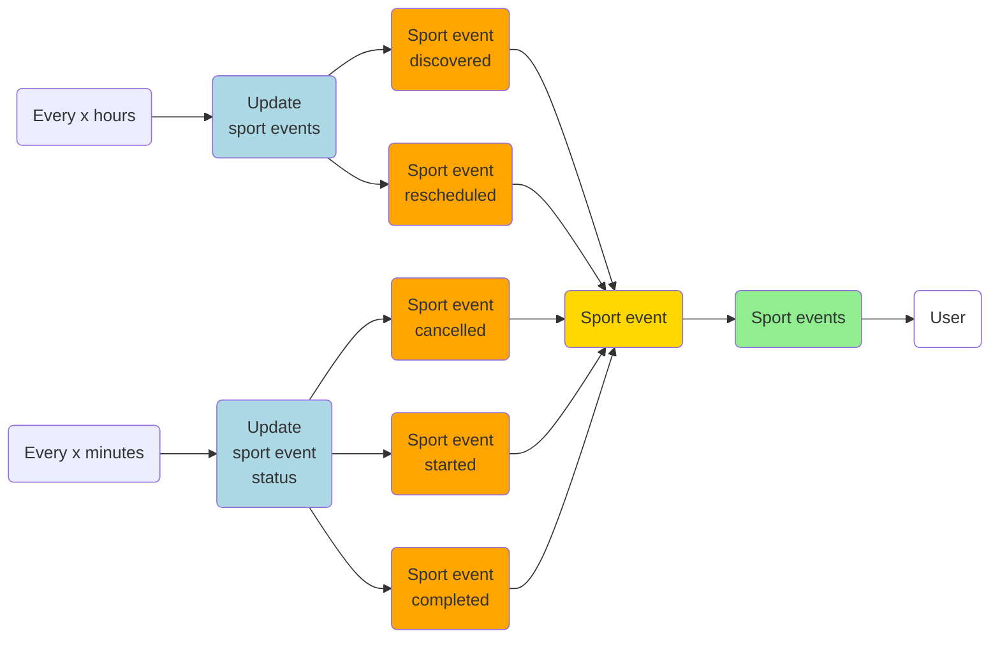

# OddsNexus

## Sports event tracker

```mermaid
flowchart LR
classDef event fill:orange
classDef aggregate fill:gold
classDef view fill:lightgreen
classDef command fill:lightblue
classDef actor fill:white
classDef process fill:lightpurple
classDef extsys fill:pink
  hourly_schedule("Every x hours"):::process-->update_sport_events("Update\nsport events"):::command
  update_sport_events-->sport_event_rescheduled("Sport event\nrescheduled"):::event
  update_sport_events-->sport_event_discovered("Sport event\ndiscovered"):::event
  minute_schedule("Every x minutes"):::process-->update_sport_event_status("Update\nsport event\nstatus"):::command
  update_sport_event_status-->sport_event_started("Sport event\nstarted"):::event
  update_sport_event_status-->sport_event_completed("Sport event\ncompleted"):::event
  update_sport_event_status-->sport_event_cancelled("Sport event\ncancelled"):::event
  sport_event_discovered & sport_event_rescheduled & sport_event_cancelled & sport_event_started & sport_event_completed-->sport_event("Sport event"):::aggregate
  sport_event-->sport_events("Sport events"):::view
  sport_events-->user("User"):::actor
```
